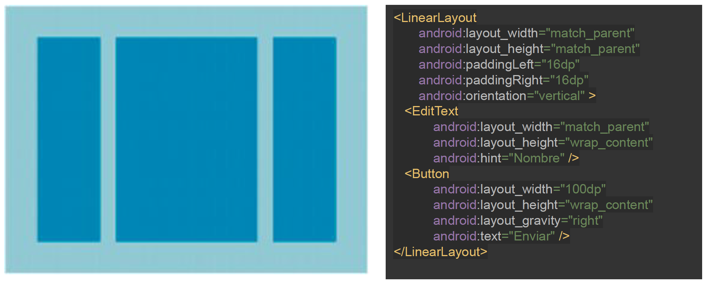
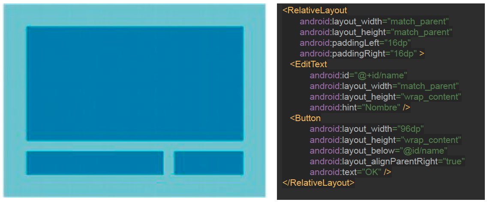
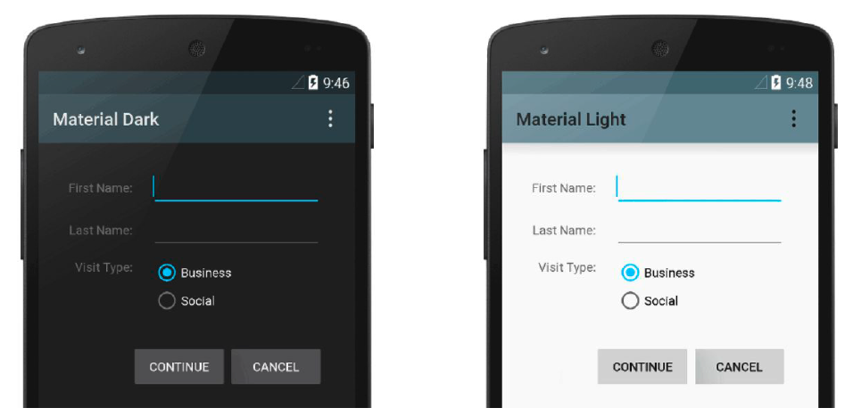
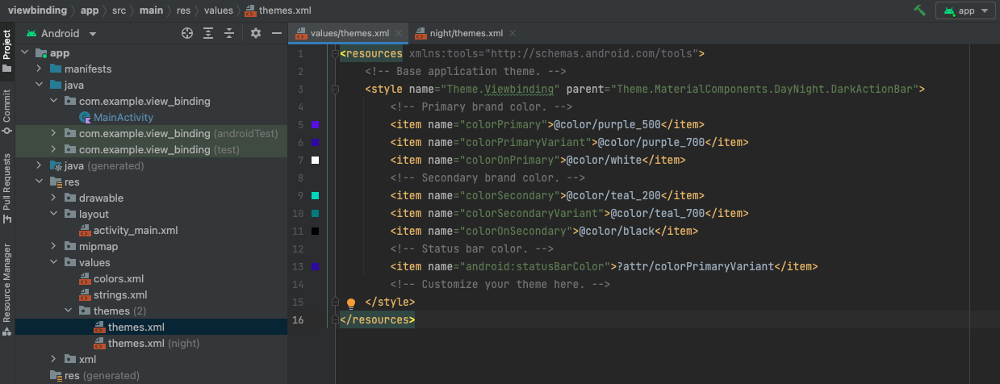
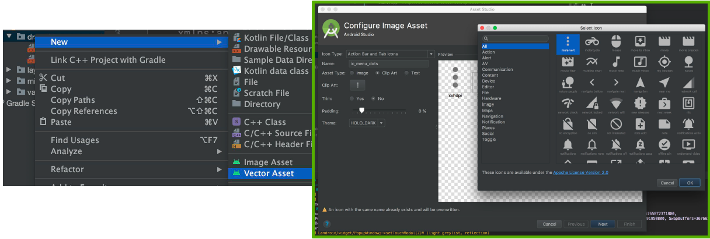
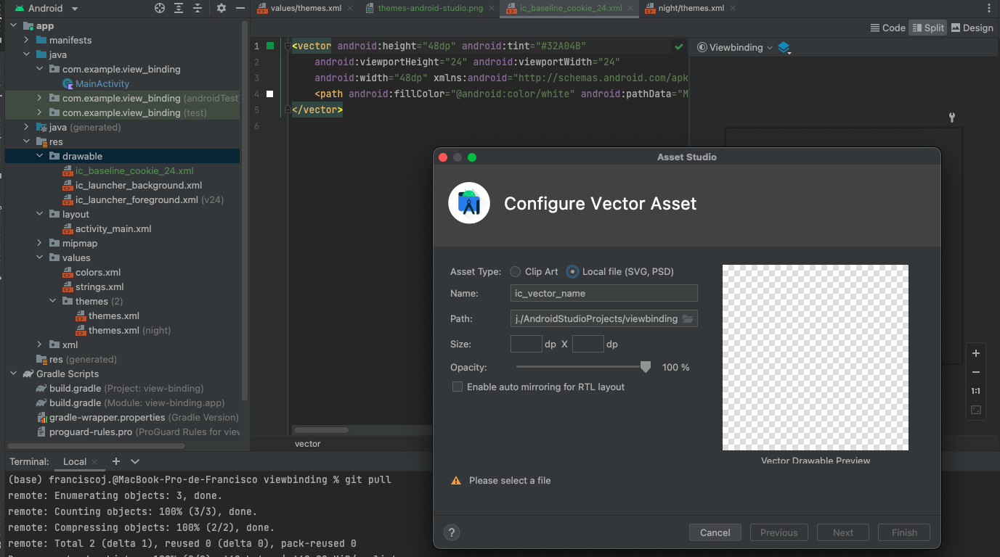
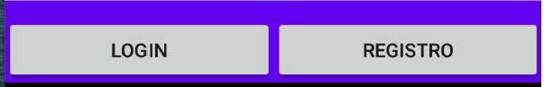
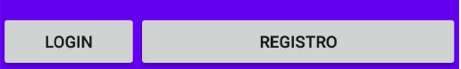
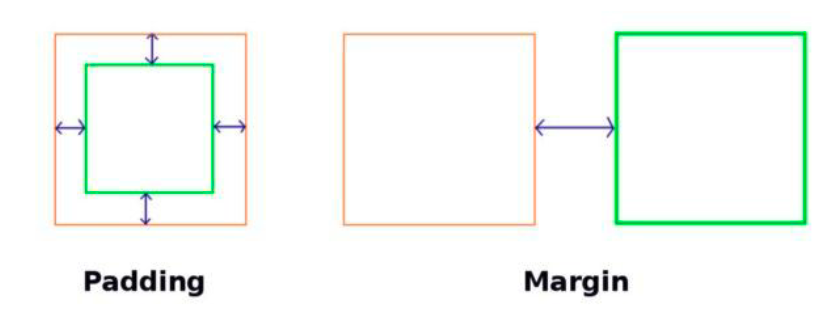
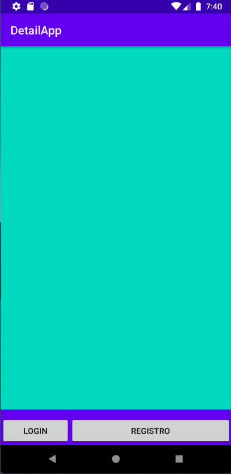

# UI Elements

**TextView**: muestra texto al usuario

```xml
<TextView
	android:id="@+id/text_id"
	android:layout_width="wrap_content"
	android:layout_height="wrap_content"
	android:text="hello_world"
	android:textColor="@android:color/holo_blue_dark"
	android:textSize="20sp"/>
```

**EditText**: Permite al usuario editar un campo de texto

```xml
<EditText
	android:id="@+id/editText"
	android:layout_width="wrap_content"
	android:layout_height="wrap_content"
	android:hint="Name"
	android:inputType="textPersonName"/>
```

**Button**: control con texto o imagen que realiza una acción cuando el usuario lo presiona

```xml
<Button
	android:layout_width="wrap_content"
	android:layout_height="wrap_content"
	android:text="Enviar" />
```

## Layouts

Si queremos combinar varios elementos de tipo vista tendremos que utilizar un objeto de tipo Layout.

Es un contenedor que alberga varias vistas y controla su posición.
Hay que destacar que un Layout puede tener varios contenedores dentro y que es un descendiente
de la clase ViewGroup.

La siguiente lista describe los Layout más utilizados en Android:

* **`LinearLayout`**: Dispone los elementos en una fila o en una columna.
* **`TableLayout`**: Distribuye los elementos de forma tabular.
* **`RelativeLayout`**: Dispone los elementos en relación a otro o al padre.
* **`FrameLayout`**: Permite el cambio dinámico de los elementos que contiene.
* **`ConstraintLayout`**: Versión mejorada de `RelativeLayout`, que permite una edición visual desde el editor y trabajar con porcentajes.

### `LinearLayout`

**LinearLayout**: Alinea todos los campos secundarios en una única dirección, de manera vertical u horizontal. Puedes especificar la dirección del diseño con el atributo `android:orientation`



```xml
<LinearLayout
	android:layout_width="match_parent"
	android:layout_height="match_parent"
	android:paddingLeft="16dp"
	android:paddingRight="16dp"
	android:orientation="vertical" >

<EditText
	android:layout_width="match_parent"
	android:layout_height="wrap_content"
	android:hint="Nombre" />

<Button
	android:layout_width="100dp"
	android:layout_height="wrap_content"
	android:layout_gravity="right"
	android:text="Enviar" />

</LinearLayout>
```

### `RelativeLayout`

Docu: https://developer.android.com/develop/ui/views/layout/relative

**RelativeLayout**: Muestra vistas secundarias en posiciones relativas. La posición de cada vista puede especificarse como relativa a elementos hermanos (como a la izquierda o debajo de otra vista) o en posiciones relativas al área de `RelativeLayout` principal (como alineada a la parte inferior, izquierda o centro. 



```xml
<RelativeLayout
	android:layout_width="match_parent"
	android:layout_height="match_parent"
	android:paddingLeft="16dp"
	android:paddingRight="16dp" >

<EditText
	android:id="@+id/name"
	android:layout_width="match_parent"
	android:layout_height="wrap_content"
	android:hint="Nombre" />

<Button
	android:layout_width="96dp"
	android:layout_height="wrap_content"
	android:layout_below="@id/name"
	android:layout_alignParentRight="true"
	android:text="OK" />

</RelativeLayout>
```

### `ConstraintLayout`

**ConstraintLayout**: Permitirá simplificar las interfaces en anidamiento, para hacerlas lo más complejas posibles a nivel de diseño. Este layout, similar al RelativeLayout nos permitirá establecer relaciones entre todos los elementos y la propia vista padre, permitiendo así ser mucho más flexible que los demás.


```xml
<RelativeLayout
	android:layout_width="match_parent"
	android:layout_height="match_parent"
	android:paddingLeft="16dp"
	android:paddingRight="16dp" >

<EditText
	android:id="@+id/name"
	android:layout_width="match_parent"
	android:layout_height="wrap_content"
	android:hint="Nombre" />

<Button
	android:layout_width="96dp"
	android:layout_height="wrap_content"
	android:layout_below="@id/name"
	android:layout_alignParentRight="true"
	android:text="OK" />

</RelativeLayout>
```

## Scrolls

También podemos utilizar otras clases de Vistas, que son descritas a continuación:

* **ScrollView**: Visualiza una columna de elementos; cuando estos no caben en pantalla se permite un deslizamiento vertical.

* **NestedScrollView**: es lo mismo que el scrollview, pero soporta comportamientos anidados.

* **HorizontalScrollView**: Visualiza una fila de elementos; cuando estos no caben en pantalla se permite un deslizamiento horizontal.


## Vinculación de vista

1. Kotlin extensions (actualmente desaconsejado)
2. `findViewById`
    * Hay que escribir más, y no es tan completa como el binding

````kotlin
findViewById<TextView>(R.id.textView)
````

3. Binding: https://developer.android.com/topic/libraries/view-binding

```kotlin
class MainActivity : AppCompatActivity() {
    
    // activity_main.xml => ActivityMainBinding 
    private lateinit var binding: ActivityMainBinding;

    override fun onCreate(savedInstanceState: Bundle?) {
        super.onCreate(savedInstanceState)

        binding = ActivityMainBinding.inflate(layoutInflater)
        val view = binding.root

        // Forma por defecto de obtener vistas:
        // setContentView(R.layout.activity_main) // Comentamos ya que vamos a utilizar binding

        setContentView(view)


        Log.i("MainActivity", "Ejecutando on create")

        val name = "Francisco Javier"
        val textView = findViewById<TextView>(R.id.textView)

        Log.i("MainActivity", textView.text.toString())
    }
}
```

## Eventos y Referencias

**Ids:**

Para poder acceder en nuestro Activity a los elementos visuales que hemos creado en el layout (xml)
todos tienen que tener un id referenciado de esta manera:

```xml
<Button
    android:id="@+id/Enviar"
    android:text="Enviar"
/>
```

Ahora desde nuestro Activity podremos acceder a los datos que contiene o modificarlos:

```kotlin
btEnviar.setOnClickListener {
    // Aquí podemos establecer lo que hará nuestro código una vez pulsado el botón con id Button
}
```

**Eventos y Referencias**

Si queremos acceder al texto introducido por el usuario en un `EditText`:

```kotlin
val text = editText.text.toString()
```

## Styles y Themes

Styles y Themes en android te permiten separar los detalles del diseño de tu app de la UI, similar a una hoja de estilos (CSS) en la web. 

Un style es una coleccioón de atributos que especifican la apariencia de una vista. Un style puede cambiar los atributos de color, fuentes, tamaños, fondos y mucho más. 





## Drawables

Recursos de elementos de diseño.

Un drawable es un tipo de recurso que puede ser dibujado en pantalla. Podremos utilizarlos para especificar el aspecto que van a tener los diferentes componentes de la interfaz, o partes de éstos. Estos drawables podrán ser definidos en XML o de forma programática. 

En la carpeta drawable con el botón derecho podemos crear un icono para utilizar en la app o importarlo desde nuestro ordenador. 






## ImageView

Un ImageView nos permite mostrar una imagen y tiene propiedades que nos ayudan a adaptarlo a lo que nos interesa.

```xml
<?xml version="1.0" encoding="utf-8"?>

<LinearLayout xmlns:android="http://schemas.android.com/apk/res/android"
	xmlns:app="http://schemas.android.com/apk/res-auto"
	xmlns:tools="http://schemas.android.com/tools"
	android:layout_width="match_parent"
	android:layout_height="match_parent"
	android:gravity="center">

	<ImageView
		android:padding="8dp"
		android:clickable="true"
		android:background="?selectableItemBackgroundBorderless"
		android:layout_width="wrap_content"
		android:layout_height="wrap_content"
		android:src="@drawable/ic_baseline_delete_24" />

</LinearLayout>
```

Si queremos que se pueda pulsar usamos clickable = true y el background indicado en el xml: 

```xml
        android:background="?selectableItemBackgroundBorderless"
```


## Weight

Podemos utilizar el peso en un componente para separarlo porcentualmente. 

Para hacer esto dentro de un ´LinearLayout` (esto solo lo podemos utilizar dentro de un `LinearLayout`) utilizando el peso es así:


```xml
<LinearLayout
	android:layout_width="match_parent"
	android:layout_height="60dp"
	android:background="@color/colorPrimary"
	android:orientation="horizontal">

	<Button
		android:id="@+id/register"
		android:layout_width="0dp" 				// <==
		android:layout_height="wrap_content"
		android:layout_weight="1" 				// <==
		android:padding="10dip"
		android:text="Login" />

	<Button
		android:id="@+id/cancel"
		android:layout_width="0dp"				// <==
		android:layout_height="wrap_content"
		android:layout_weight="1"				// <==
		android:padding="10dip"
		android:text="Registro" />

</LinearLayout>
```



Y jugando con los valores del peso obtenemos lo siguiente:

```xml
<LinearLayout
	android:layout_width="match_parent"
	android:layout_height="60dp"
	android:background="@color/colorPrimary"
	android:orientation="horizontal">

	<Button
		android:id="@+id/register"
		android:layout_width="0dp"				// <==
		android:layout_height="wrap_content"
		android:layout_weight="0.3"				// <==
		android:padding="10dip"
		android:text="Login" />

	<Button
		android:id="@+id/cancel"
		android:layout_width="0dp"				// <==
		android:layout_height="wrap_content"
		android:layout_weight="0.7"				// <==
		android:padding="10dip"
		android:text="Registro" />

</LinearLayout>
```



## Espacios

* **margin** - Distancia entre los 4 lados
* **marginLeft** - Distancia en el lado izquierdo
* **marginRight** - Distancia en el lado derechpo
* **marginTop** - Distancia en el lado de arriba
* **marginBottom** - Distancia en el lado de abajo
* **padding** - Distancia entre los 4 lados desde dentro
* **paddingLeft** - Distancia en el lado izquierdo desde dentro
* **paddingRight** - Distancia en el lado derechpo desde dentro
* **paddingTop** - Distancia en el lado de arriba desde dentro
* **paddingBottom** - Distancia en el lado de abajo desde dentro





## Mover contenedores por la vista

```xml
<?xml version="1.0" encoding="utf-8"?>

<RelativeLayout xmlns:android="http://schemas.android.com/apk/res/android"
		xmlns:app="http://schemas.android.com/apk/res-auto"
		xmlns:tools="http://schemas.android.com/tools"
		android:layout_width="match_parent"
		android:layout_height="match_parent"
		android:orientation="vertical"
		android:background="@color/colorAccent"
		tools:context=".MainActivity">

	<LinearLayout
		android:layout_width="match_parent"
		android:layout_height="60dp"
		android:layout_alignParentBottom="true"
		android:background="@color/colorPrimary"
		android:gravity="bottom"
		android:orientation="horizontal">

		<Button
			android:id="@+id/register"
			android:layout_width="0dp"
			android:layout_height="wrap_content"
			android:layout_weight="0.3"
			android:padding="10dip"
		android:text="Login" />

		<Button
			android:id="@+id/cancel"
			android:layout_width="0dp"
			android:layout_height="wrap_content"
			android:layout_weight="0.7"
			android:padding="10dip"
			android:text="Registro" />

	</LinearLayout>

</RelativeLayout>
```




